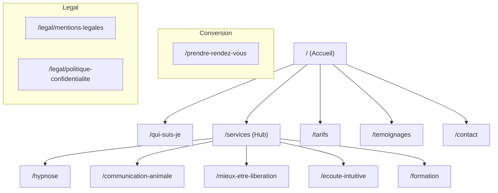

# Design Document - Katia Burgun SEO 2026

## 1. Requirements

**Objective**: Modernize the website `katia-burgun.fr` to meet 2026 SEO standards and maximize the chances of obtaining Google Sitelinks.

### Key Goals:
- **Sitelinks Optimization**: Structure the site so Google clearly identifies main pages (Services, Tarifs, Contact, Rendez-vous).
- **Technical SEO**: Separate and optimize `sitemap.xml` and `robots.txt`.
- **Semantic Data**: Implement full JSON-LD (Organization, Person, WebSite, BreadcrumbList).
- **Performance**: Achieve perfect Core Web Vitals using `next/image` and efficient Next.js App Router patterns.
- **User Experience**: Ensure a logical, crawlable hierarchy in the Header and Footer.

---

## 2. Site Architecture (Flow)

The site is organized into a clear hierarchy to guide both users and crawlers.

### Navigation Strategy:
- **Header**: Contains the primary conversion path and main services.
- **Footer**: Reinforces the site structure by repeating all main links, providing "Fat Footer" benefits.
- **Internal Linking**: Every service page links back to the "Hub" and to the "Tarifs/Booking" pages.

---

## 3. Technical Implementation (Utilities)

### Metadata API (Next.js)
Used in `layout.tsx` and individual `page.tsx` files to manage:
- Dynamic titles and descriptions.
- Canonical URLs.
- Open Graph / Twitter Cards.

### Special Files
- `src/app/sitemap.ts`: Dynamic sitemap generation.
- `src/app/robots.ts`: Crawler instructions.

### Structured Data (JSON-LD)
A suite of components to inject schema.org data:
- `LocalBusiness`: Name, address, phone, geo-coordinates.
- `Person`: Katia Burgun's professional profile.
- `BreadcrumbList`: Injected on every sub-page to clarify hierarchy.

---

## 4. Implementation Checklist

| Step | Action | Status |
| :--- | :--- | :--- |
| 1 | Migrate legacy `` to `next/image` | In Progress |
| 2 | Configure global Metadata in `layout.tsx` | Done |
| 3 | Create `app/sitemap.ts` and `app/robots.ts` | Todo |
| 4 | Implement Header/Footer with crawlable links | Todo |
| 5 | Add JSON-LD (Organization, Person, WebSite) | Done (LocalBusiness) |
| 6 | Create dedicated pages for each service | Todo |
| 7 | Submit to Google Search Console | Future |
